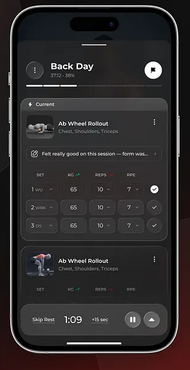
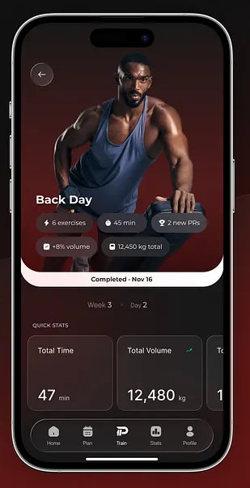

<div align="center">

  # 🏋🏻‍♂️ PUMPED

  ### Your fitness. Your progress. Your community.

  Landing page responsiva para o conceito de um aplicativo fitness, desenvolvida com **HTML5 e CSS3**, com foco em uma experiência visual moderna, minimalista e totalmente adaptável a diferentes dispositivos.

  <br />

  
  
  
  

</div>

---

## 📖 Sobre o Projeto

O **PUMPED** é uma landing page criada para apresentar o conceito de um aplicativo voltado para **fitness, saúde, exercícios e interação social**.

A interface utiliza uma estética **minimalista em preto e branco**, combinando tipografia, espaçamento, imagens e microinterações para criar uma apresentação visual moderna e objetiva.

O projeto foi desenvolvido como uma aplicação **front-end estática**, utilizando apenas tecnologias nativas da Web:

- 🧱 HTML5
- 🎨 CSS3
- 🔤 Google Fonts
- 🖼️ Imagens locais

> 💡 **Sem frameworks, sem bibliotecas de UI e sem processo de build.**

---

## 🎯 Objetivo

O principal objetivo do projeto é construir uma **landing page de alta qualidade visual** para um produto digital fictício, explorando conceitos de:

- 📐 Layout responsivo
- 📱 Desenvolvimento **Mobile-First**
- 🎨 Design minimalista
- 🪟 Hierarquia visual
- ✨ Microinterações
- 🧩 Organização semântica do HTML
- 🎯 Call-to-actions
- 🖼️ Apresentação de mockups
- 🧭 Navegação entre seções
- ⚡ CSS moderno

---

## 🖥️ Demonstração

### 🏠 Página Inicial

<p align="center">
  
</p>

### 🔥 Outras telas do aplicativo

<p align="center">
  
  
</p>

---

## ✨ Funcionalidades

### 🧭 Navegação

O cabeçalho apresenta:

- 🏋🏻‍♂️ Identidade visual do PUMPED
- 🏠 Link para a seção inicial
- ✨ Link para funcionalidades
- 📩 Link para contato
- 📲 Call-to-action para download do aplicativo

A navegação utiliza rolagem suave para proporcionar uma transição mais agradável entre as seções.

---

### 📱 Menu Mobile

Em telas menores, a navegação é adaptada para um **menu hambúrguer**.

O menu é implementado utilizando apenas:

- HTML
- CSS
- Interações nativas

Não é necessário JavaScript ou biblioteca externa para implementar esse comportamento.

---

### 🚀 Seção Hero

A seção principal apresenta:

- 🎯 Headline de destaque
- 📝 Texto introdutório
- 📱 Mockup do aplicativo
- ❤️ Benefícios da plataforma
- 🏃🏻‍♀️ Exercícios
- 🥗 Saúde
- 👥 Comunidade

O objetivo é apresentar rapidamente a proposta do produto e direcionar o usuário para a ação principal.

---

### 🧩 Seção de Funcionalidades

A seção de funcionalidades apresenta os principais recursos do conceito PUMPED através de layouts alternados.

#### 🥗 Controle Alimentar

Apresentação do conceito de acompanhamento inteligente da alimentação e das calorias.

#### 🏃🏻‍♀️ Exercícios Direcionados

Apresentação de exercícios e treinos direcionados aos objetivos do usuário.

#### 👥 Comunidade

Recursos voltados para interação social e conexão entre usuários.

---

### ✨ Microinterações

A interface possui diversos efeitos visuais para tornar a navegação mais dinâmica:

- 🖱️ Hover em links
- 🔘 Hover em botões
- 🃏 Animações em cards
- 📱 Efeitos nos mockups
- 📈 Transformações com `scale`
- 🔄 Transições suaves
- 🌊 Rolagem suave entre seções

Essas interações ajudam a fornecer feedback visual ao usuário sem comprometer a simplicidade da interface.

---

# 📱 Design Responsivo

Um dos principais objetivos do projeto é proporcionar uma experiência consistente em diferentes tamanhos de tela.

A interface foi desenvolvida seguindo o padrão **Mobile-First**.

## 📐 Abordagem Mobile-First

Em vez de desenvolver primeiro para desktops e posteriormente adaptar para dispositivos móveis, o projeto parte inicialmente de uma estrutura otimizada para **telas pequenas**.

A partir dessa base, o layout é progressivamente expandido para telas maiores através de **Media Queries**.

### 📱 Estratégia

```text
📱 Mobile
   ↓
📲 Tablet
   ↓
💻 Notebook
   ↓
🖥️ Desktop
   ↓
🖥️ Large Desktop
````

Essa abordagem facilita a criação de interfaces mais flexíveis e evita que a experiência em dispositivos móveis seja tratada apenas como uma adaptação da versão desktop.

---

## 📏 Breakpoints

O projeto utiliza os seguintes pontos de quebra:

| Breakpoint |  Largura  | Aplicação           |
| :--------: | :-------: | :------------------ |
|   📱 Base  | `< 640px` | Smartphones         |
|   📲 `sm`  |  `640px`  | Smartphones maiores |
|   📲 `md`  |  `768px`  | Tablets             |
|   💻 `lg`  |  `1024px` | Notebooks           |
|  🖥️ `xl`  |  `1280px` | Desktops            |
|  🖥️ `2xl` |  `1536px` | Monitores grandes   |

Os elementos da interface se reorganizam progressivamente conforme o espaço disponível aumenta.

---

## 🎨 Identidade Visual

A identidade visual do PUMPED utiliza uma abordagem minimalista baseada principalmente em **preto, branco e tons neutros**.

O design prioriza:

* ⚫ Alto contraste
* ⚪ Espaços em branco
* 🔤 Tipografia forte
* 📐 Composição geométrica
* 🖼️ Imagens de destaque
* 🎯 Hierarquia visual
* ✨ Microinterações discretas

Essa combinação cria uma interface moderna e focada no conteúdo.

---

## 🔤 Tipografia

A aplicação utiliza a fonte **Roboto**, disponibilizada através do Google Fonts.

A utilização de diferentes pesos tipográficos permite criar uma hierarquia visual clara entre:

* 🏷️ Títulos
* 📝 Textos
* 🔘 Botões
* 🧭 Navegação
* 📊 Informações complementares

---

## ♿ Estrutura e Experiência do Usuário

A estrutura da página utiliza elementos HTML semânticos para organizar o conteúdo de forma lógica.

A interface também considera aspectos importantes de experiência do usuário, como:

* 🧭 Navegação clara
* 📖 Hierarquia de conteúdo
* 👆🏼 Áreas de interação bem definidas
* 🎯 CTAs destacados
* 📱 Adaptação para telas pequenas
* 🖱️ Feedback visual através de estados `hover`
* 🌊 Rolagem suave

---

## 🛠️ Tecnologias Utilizadas

| Tecnologia    | Utilização                                     |
| :------------ | :--------------------------------------------- |
| 🧱 **HTML5**  | Estrutura semântica e conteúdo da página       |
| 🎨 **CSS3**   | Layout, responsividade, animações e interações |
| 🔤 **Roboto** | Tipografia através do Google Fonts             |
| 🖼️ **PNG**   | Imagens e mockups utilizados na apresentação   |

### 🚫 Sem Frameworks

O projeto foi desenvolvido sem frameworks ou bibliotecas frontend.

Não utiliza:

* ❌ React
* ❌ Vue
* ❌ Angular
* ❌ Bootstrap
* ❌ Tailwind CSS

A interface é construída utilizando **HTML e CSS puros**.

---

## 🧩 Conceitos de CSS Utilizados

O projeto explora diversos recursos modernos do CSS, incluindo:

* 📐 Flexbox
* 🧱 CSS Grid
* 📱 Media Queries
* 🎨 Gradientes
* ✨ Transições
* 🖱️ Pseudo-classes
* 🔄 `transform`
* 🌊 `scroll-behavior`
* 🎯 Posicionamento responsivo
* 📏 Unidades relativas
* 🎭 Estados de interação

---

## 📂 Estrutura do Projeto

```text
pumped-landing-page/
│
├── assets/
│   └── images/
│       ├── image-1.png      # Tela inicial/social do aplicativo
│       ├── image-2.png      # Tela de acompanhamento de calorias
│       └── image-3.png      # Tela de exercícios direcionados
│
├── docs/
│   └── plan.md              # Briefing e planejamento inicial
│
├── index.html               # Estrutura e conteúdo da landing page
├── styles.css               # Estilos, responsividade e interações
└── README.md                # Documentação do projeto
```

---

## 🗂️ Estrutura da Página

| Seção             | Descrição                            |
| :---------------- | :----------------------------------- |
| 🧭 **Header**     | Logo, navegação e CTA para download  |
| 🚀 **Hero**       | Apresentação principal do produto    |
| ❤️ **Benefícios** | Saúde, exercícios e comunidade       |
| 🥗 **Nutrição**   | Conceito de acompanhamento alimentar |
| 🏃🏻‍♀️ **Treinos**    | Exercícios direcionados              |
| 👥 **Comunidade** | Recursos sociais                     |
| 🦶🏻 **Footer**     | Informações de direitos autorais     |

---

## 🔗 Navegação e CTAs

A landing page possui chamadas para ação distribuídas pela interface.

### 📲 Baixar App

Os botões de download utilizam a âncora:

```text
#download
```

---

## 🚀 Como Executar Localmente

O projeto é totalmente estático e não possui dependências ou processo de compilação.

### 📋 Pré-requisitos

Você precisa apenas de:

* 🌐 Um navegador moderno
* 📁 Os arquivos do projeto
* 💻 Opcionalmente, VS Code

---

### 1️⃣ Clone o repositório

```bash
git clone https://github.com/romaosantosalisson/pumped-landing-page.git
```

### 2️⃣ Entre na pasta

```bash
cd pumped-landing-page
```

### 3️⃣ Abra o projeto

Abra o arquivo:

```text
index.html
```

diretamente no navegador.

---

## 💻 Utilizando o Live Server

Para uma experiência melhor durante o desenvolvimento, você pode utilizar a extensão **Live Server** no Visual Studio Code.

### Passos

1. 📂 Abra o projeto no VS Code.
2. 🔌 Instale a extensão Live Server.
3. ▶️ Clique em **Go Live**.
4. 🌐 O projeto será aberto automaticamente no navegador.
5. 🔄 As alterações serão atualizadas automaticamente.

---

## ✏️ Personalização

### 📝 Conteúdo

Os textos e a estrutura da página podem ser alterados no:

```text
index.html
```

### 🎨 Estilos

Cores, espaçamentos, tipografia, animações e breakpoints podem ser ajustados em:

```text
styles.css
```

### 🖼️ Imagens

As imagens utilizadas pela landing page estão localizadas em:

```text
assets/images/
```

Para substituí-las, mantenha os nomes dos arquivos ou atualize os respectivos caminhos no `index.html`.

---

## 🎓 Conceitos Praticados

Este projeto permite praticar diversos fundamentos do desenvolvimento frontend:

* 🧱 HTML semântico
* 🎨 CSS moderno
* 📱 Design **Mobile-First**
* 📐 Layout responsivo
* 🧩 Flexbox
* 🧱 CSS Grid
* 📏 Media Queries
* ✨ CSS Transitions
* 🖱️ Estados `hover`
* 🔄 Transformações CSS
* 🧭 Navegação interna
* 🌊 Smooth Scrolling
* 🖼️ Responsividade de imagens
* 🎯 Hierarquia visual
* 📱 Interface adaptável

---

## 💡 Destaques Técnicos

### 📱 Mobile-First

A estrutura inicial do CSS é pensada para dispositivos móveis e utiliza Media Queries para expandir o layout conforme a largura da tela aumenta.

### 🎨 CSS Puro

Toda a interface visual é construída utilizando CSS nativo, sem frameworks ou bibliotecas de componentes.

### 🧩 Layout Flexível

Flexbox e Grid são utilizados para organizar os diferentes elementos da landing page e permitir que eles se adaptem aos diferentes tamanhos de viewport.

### ✨ Microinterações

Transições e transformações CSS fornecem feedback visual durante a interação com botões, links, cards e mockups.

### 🌊 Navegação Suave

A propriedade `scroll-behavior` proporciona uma transição suave ao navegar entre as seções da página.

---

## 📌 Status do Projeto

<div align="center">

🟢 **Concluído**

Projeto desenvolvido como uma landing page estática para prática e demonstração de conceitos de desenvolvimento frontend.

</div>

---

## 👨🏻‍💻 Autor

<div align="center">

### Álisson Romão Santos

Desenvolvido com ❤️ e ☕ utilizando HTML5 e CSS3.

  <br />

  <a href="https://github.com/romaosantosalisson">
    
  </a>

</div>

---

<div align="center">

### ⭐ Gostou do projeto?

Se o **PUMPED** foi útil ou interessante para você, considere deixar uma ⭐ no repositório!

  <br />

🏋🏻‍♂️ **PUMPED**

  <br />

*Feito com ❤️ e ☕ por Álisson Romão Santos.*

  <br />

**© 2026 — Álisson Romão Santos**

</div>
