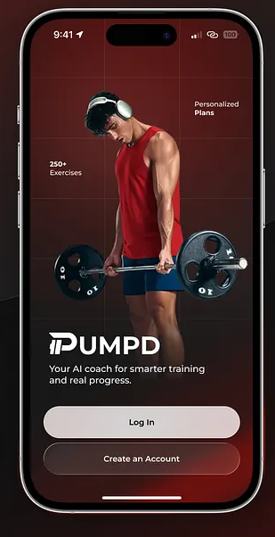

# PUMPED — Landing Page
## Versão em Português
[🇬🇧 English Version](#-english-version)

Landing page responsiva para o conceito de aplicativo fitness **PUMPED**. O projeto apresenta uma interface minimalista em preto e branco, criada com HTML e CSS puros, para destacar acompanhamento de saúde, exercícios e recursos sociais.

## Visão geral

A página foi construída como um projeto front-end estático, sem dependências, framework ou etapa de compilação. Ela utiliza a fonte Roboto do Google Fonts e capturas de tela locais do aplicativo para compor a apresentação.



## Funcionalidades da página

- Cabeçalho fixo com marca PUMPED, navegação e botão de download.
- Menu hambúrguer em telas menores, implementado somente com HTML e CSS.
- Seção hero com chamada principal, mockup do aplicativo e cartões de benefícios.
- Seção de funcionalidades com layouts alternados para apresentar nutrição, treinos e comunidade.
- Efeitos de hover em links, botões, cartões e mockups.
- Layout responsivo com pontos de quebra em 640 px, 768 px, 1024 px, 1280 px e 1536 px.
- Rolagem suave entre as seções internas.

## Tecnologias

- HTML5
- CSS3
- [Roboto](https://fonts.google.com/specimen/Roboto), via Google Fonts

## Estrutura do projeto

```text
.
├── assets/
│   └── images/
│       ├── image-1.png      # Tela inicial/social do aplicativo
│       ├── image-2.png      # Tela de contagem de calorias
│       └── image-3.png      # Tela de exercícios direcionados
├── docs/
│   └── plan.md              # Briefing e plano inicial do projeto
├── index.html               # Estrutura e conteúdo da landing page
├── styles.css               # Estilos, interações e responsividade
└── README.md
```

## Seções

| Seção | Conteúdo |
| --- | --- |
| Cabeçalho | Logo, links para Home, Funcionalidades e Contato, além do CTA “Baixar App”. |
| Hero | Mensagem principal, tela inicial do app e benefícios: Saúde, Exercício e Amigos. |
| Funcionalidades | Controle alimentar inteligente, exercícios direcionados e conexão social. |
| Rodapé | Aviso de direitos reservados de 2026. |

## Como executar localmente

1. Clone este repositório:

   ```bash
   git clone <URL-DO-REPOSITORIO>
   ```

2. Entre na pasta do projeto:

   ```bash
   cd pumped-landing-page
   ```

3. Abra o arquivo `index.html` no navegador.

Como alternativa, use a extensão **Live Server** do VS Code para servir a página localmente e atualizar as alterações automaticamente.

## Personalização

- Edite os textos e a estrutura da página em `index.html`.
- Ajuste as cores, espaçamentos, animações e breakpoints em `styles.css`. As variáveis CSS no seletor `:root` centralizam os principais tokens visuais.
- Substitua as imagens em `assets/images/`, mantendo os mesmos nomes ou atualizando os caminhos no HTML.

## Observações

Os botões e links de “Baixar App” apontam para a âncora `#download`, e o link “Contato” aponta para `#contato`. Essas seções ainda não existem no HTML, portanto podem ser adicionadas quando houver um destino real para essas ações.

<div align="center">Feito com ❤️ e ☕ por <strong>Álisson</strong> &copy; 2026</div 

---
# PUMPED
## 🇬🇧 English Version
[🇧🇷 Versão em Português](#versão-em-português)

Responsive landing page for the **PUMPED** fitness app concept. The project uses a clean black-and-white interface built with plain HTML and CSS to showcase health tracking, workouts, and social features.

## Overview

This is a static front-end project with no dependencies, frameworks, or build step. It loads the Roboto typeface from Google Fonts and uses local app screenshots to support the presentation.


## Page features

- Sticky header with the PUMPED brand, navigation, and a download button.
- Mobile hamburger menu implemented with HTML and CSS only.
- Hero section with a headline, app mockup, and benefit cards.
- Feature section with alternating layouts for nutrition, workouts, and community.
- Hover effects for links, buttons, cards, and phone mockups.
- Responsive layout with breakpoints at 640 px, 768 px, 1024 px, 1280 px, and 1536 px.
- Smooth scrolling between in-page sections.

## Technologies

- HTML5
- CSS3
- [Roboto](https://fonts.google.com/specimen/Roboto), loaded from Google Fonts

## Project structure

```text
.
├── assets/
│   └── images/
│       ├── image-1.png      # App home/social screen
│       ├── image-2.png      # Calorie-tracking screen
│       └── image-3.png      # Targeted-workout screen
├── docs/
│   └── plan.md              # Original brief and project plan
├── index.html               # Landing page structure and content
├── styles.css               # Styles, interactions, and responsiveness
└── README.md
```

## Sections

| Section | Content |
| --- | --- |
| Header | Logo, Home, Features, and Contact links, plus the “Baixar App” CTA. |
| Hero | Main message, app home screen, and Health, Exercise, and Friends benefits. |
| Features | Smart food tracking, targeted exercises, and social connection. |
| Footer | 2026 copyright notice. |

## Run locally

1. Clone the repository:

   ```bash
   git clone <REPOSITORY-URL>
   ```

2. Move into the project directory:

   ```bash
   cd pumped-landing-page
   ```

3. Open `index.html` in your browser.

Alternatively, use the **Live Server** VS Code extension to serve the page locally and refresh changes automatically.

## Customization

- Change page copy and markup in `index.html`.
- Adjust colors, spacing, animations, and breakpoints in `styles.css`. The CSS variables in `:root` centralize the main visual tokens.
- Replace images under `assets/images/`, keeping their filenames or updating the image paths in the HTML.

## Notes

The “Baixar App” buttons link to the `#download` anchor, and the Contact link points to `#contato`. Those sections are not present in the current HTML yet, so they can be added when real destinations are available.

---
<div align="center">Made with ❤️ and ☕ by <strong>Álisson</strong> &copy; 2026</div 
